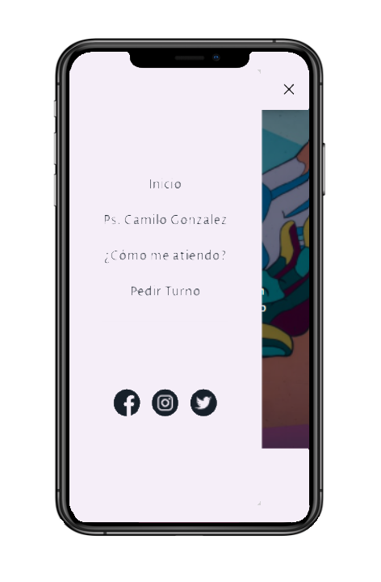

# ¡¡Hola!!👋

Soy psicólogo, y he trabajado en ello desde 2016, pero hace poco me apasioné por el desarrollo web. Recientemente empecé a estudiar React y estoy desarrollando difernetes proyectos. Hasta ahora el recorrido que he hecho ¡me ha encantado! 💜💜💜

Nací en Colombia y hace unos años emigre a la Ciudad Autónoma de Buenos Aires ✈️ Me gustaría hacer parte de algún proyecto y poder aprender mientras aporto. Lo colaborativo siempre es mejor 😄

El año pasado creé mi primera página web en wordpress, ese fue el detonante. COn mis conociemientos actuales la mejoré creandola desde cero con React y Next. Si gustas puedes visitarla en [murocincelado.vercel.app](https://murocincelado.vercel.app/) y aquí esta el [repositorio](https://github.com/jmilo13/muro-cincelado)

  

Para mi primer curso de introducción, hice una replica de la página de inicio en HTML CSS y JS, utilizando también Bootstrap. Aqui esta el [repositorio](https://github.com/jmilo13/muro_cincelado) y puedes visualizarlo [aquí](https://jmilo13.github.io/muro_cincelado/).

 

Todos mis trabajos son responsive, adaptables a difernetes dispositivos. Esta es una buena comparativa de mi recorrido, de un HTML con estilos pase a un proyecto con JSX, CSS-in-JS y un enrutado que integra Server Side Rendering y Client Side Rendering 😎
