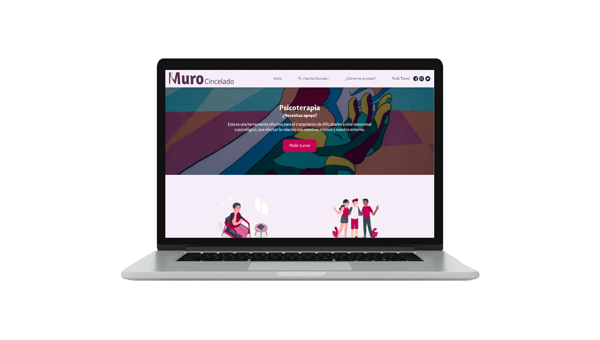
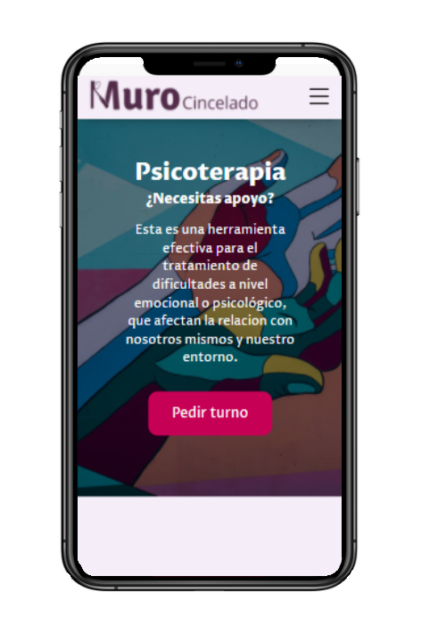

# ¡¡Hola!!👋 

Soy psicólogo, pero me apasioné por el desarrollo web. Actualmente estoy aprendiendo un montón. Es como haber descubierto un universo paralelo que siempre estuvo allí pero recién tuve la fortuna de conocer. Hasta ahora me ha encantado.

Me gustaría hacer parte de algún proyecto y poder aprender mientras aporto. Lo colaborativo siempre es mejor 😄

Hace unos meses cree mi propia página web. Si gustas puedes visitarla en [murocincelado.com](https://murocincelado.com/) 

También cree una replica de la primera versión del sitio completamente en HTML CSS y JS, utilizando también Bootstrap. Aqui esta el [repositorio](https://github.com/jmilo13/muro_cincelado) y puedes [visualizarlo](https://jmilo13.github.io/muro_cincelado/) gracias a GitHub-page.

<!--
**jmilo13/jmilo13** is a ✨ _special_ ✨ repository because its `README.md` (this file) appears on your GitHub profile.

Here are some ideas to get you started:

- 🔭 I’m currently working on ...
- 🌱 I’m currently learning ...
- 👯 I’m looking to collaborate on ...
- 🤔 I’m looking for help with ...
- 💬 Ask me about ...
- 📫 How to reach me: ...
- 😄 Pronouns: ...
- ⚡ Fun fact: ...
-->
